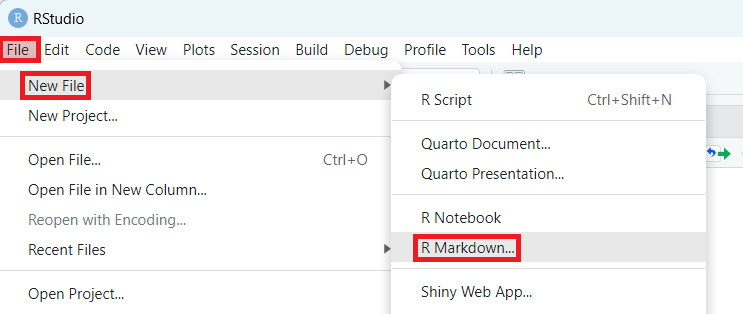

# 2. Creating and Compiling(Knitting/Rendering) an R Markdown File

## 2.1 Installing the Package
In order to use R Markdown in R Studio, you first need to install and load two packages: `rmarkdown` and `tinytex`. The process can be done either through the Package tab at the right bottom or a few lines of code.

Option 1:


Option 2:

Input
{: .label .label-green}
```r
# Vector of package names
packages <- c("rmarkdown", "tinytex")

# Check if each package is installed and install if not
lapply(packages, function(x) {
  if(!require(x, character.only = TRUE)) {
    install.packages(x)
    library(x, character.only = TRUE)
  }
})
```

## 2.2 Creating an R Markdown File



## 2.3 Organizing an R Markdown File
<p>Put all of the code that should be run together in the same code chunk. This about 1 chunk = 1 output (analysis or table). </p>
<p>Use the outline section to find your way around. Code chunk names and headers are critical. </p>


## 2.4 Compiling(Knitting/Rendering) an R Markdown File
Once a new Rmd file is created, it contains some sample content. Let's go ahead and experiment with knitting it for now.

Option 1:


Option 2:

Input
{: .label .label-green}
```r
rmarkdown::render('test.Rmd', 'html_document')
```

<br>

<br>
This page is meant to walk you through the process of installing the necessary packages, opening and rendering an R Markdown file, in order to get you ready move on to learn how to make an R Markdown file for your own needs.
<br>
A pause here for questions.
