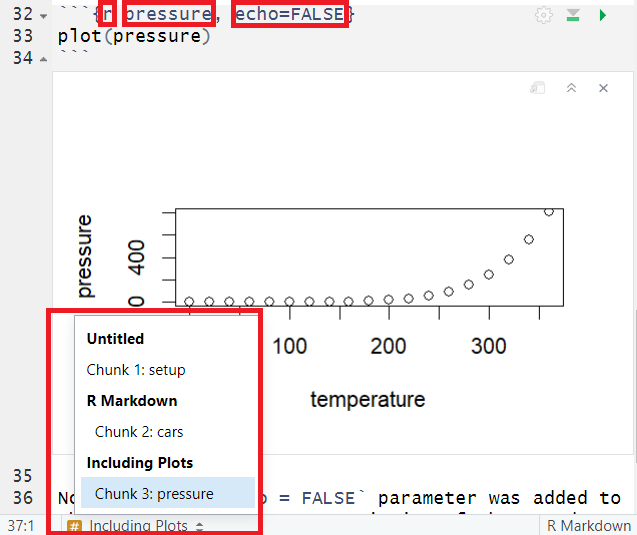

# 3 Make Your Own R Markdown File

## 3.1 Basic Structure of an R Markdown File
Three main components:

**Header**: Typically enclosed within a set of three dashes (`---`) at the top of the document, the header contains metadata information about the document itself, such as the document title, author, and output format.


**Text**: After the header is the narrative text written in Markdown syntax, which allows you to format text, add headings, lists, and links, among other things.


**Code Chunk**: Enclosed within a set of three backticks (<code>```</code>), code chunks are sections of code that are executed and displayed as output in the final document.
Code can also be inline, enclosed by a backtick (<code>`</code>).


## 3.2 Text - Markdown Syntax

**Markdown** exists independently. It is a powerful and flexible tool for writing and formatting text, and its simplicity makes it a popular choice for many different types of content creation. **R Markdown** is a variant/extension of Markdown.

### Practice
Check the first page of the [R Markdown Reference Guide](https://www.rstudio.com/wp-content/uploads/2015/03/rmarkdown-reference.pdf) for quick referral, copy the following text to the end of the Rmd file that you created, and figure out how to format it in order to be knitted like the picture provided.

Plain Text
{: .label .label-green}
```
Practice
3.2.1 Text - Markdown Syntax
Markdown exists independently. It is a powerful and flexible tool for writing and formatting text, and its simplicity makes it a popular choice for many different types of content creation. R Markdown is a variant/extension of Markdown.

Check the first page of the R Markdown Reference Guide https://www.rstudio.com/wp-content/uploads/2015/03/rmarkdown-reference.pdf for quick referral, copy the following text to the end of the Rmd file that you created, and figure out how to format it in order to be knitted like the picture provided.

Pay attention to:

Italic Text
Bold Text
Links
Headers
List

Feel free to add more elements, such as a equation or a table.

3.2.2 Code Chunk - Knitr Chunk Options
Check the second and third page of the R Markdown Reference Guide https://www.rstudio.com/wp-content/uploads/2015/03/rmarkdown-reference.pdf for quick referral.

3.2.3 Header - YAML Arguments
Check the Lesson 4: YAML Headers from R Markdown Crash Course https://zsmith27.github.io/rmarkdown_crash-course/lesson-4-yaml-headers.html for quick referral.
```


## 3.3 Code Chunk - Knitr Chunk Options
There is a **curly brace** (<code>{}</code>) following the first three backticks in a code chunk,  which is sometime referred to as the **code chunk header**. Within the curly brace, there are
- The **programming language** used in this code chunk. We use R, while [other languages are possible](https://bookdown.org/yihui/rmarkdown/language-engines.html).
- The **name** of the code chunk, following the language with a _space_.
    - Naming the code chunks makes it easy to navigate when you have many chunks in your Rmd file.
    - It also serves for [referencing](https://bookdown.org/yihui/rmarkdown/bookdown-markdown.html#text-references:~:text=Chapter%20%5C%40ref(intro)-,Figures,-%3A) purposes in your rendered document.
- The **chunk options** separated by commas. Chunk options contol [a lot of things](https://yihui.org/knitr/options/), such as whether to present code chunks or their outputs in the rendered document.



### Practice
Check the second and third page of the [R Markdown Reference Guide](https://www.rstudio.com/wp-content/uploads/2015/03/rmarkdown-reference.pdf) for quick referral, and perform the following task.
- Add a code chunk to install and load the tidyverse package
```
if (!require(tidyverse)) {
  install.packages("tidyverse")
  library(tidyverse)
}
```
    - Knit the Rmd file to check for the message resulted from the new code chunk
    - Add `message=FALSE` to the code chunk header to remove the messages from the final report.
- Add a code chunk to make a scatter plot using the iris data
```
data(iris)
ggplot(iris, aes(Sepal.Length, Sepal.Width, color = Species)) +
  geom_point()
```
    - Add `fig.cap = 'Iris Septal Length and Width by Species'` to the code chunk header.

## 3.4 Header - YAML Arguments
The header contains metadata about your document. Each line within it is a YAML argument. Title, author, date, ouput are the most common YAML argument. You can also add table of content, or apply some global features to the document.

### Practice
Check the [Lesson 4: YAML Headers from R Markdown Crash Course](https://zsmith27.github.io/rmarkdown_crash-course/lesson-4-yaml-headers.html) for quick referral, and perform the following tasks.
- Replace the output section in the header by the following code, knit and check the table of content.
```
output:
  html_document:
    toc: TRUE
    toc_float: TRUE
```
- Add `code_folding: show` after the toc arguments, knit and see what code folding does.


<br>
<br>
This page is meant to introduce the basic structure of Rmd files and get you started working with Rmd.
<br>
A pause here for questions.
